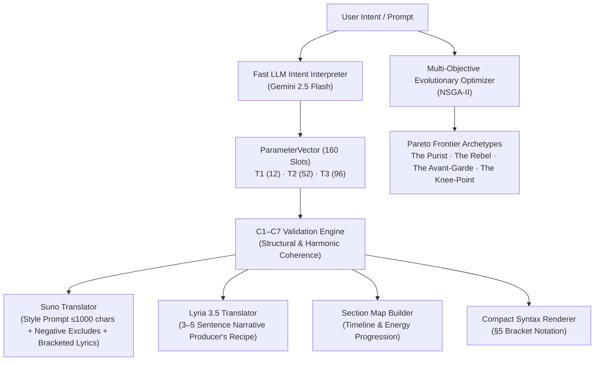

# COMPOSER-160 (AKSAN Edition)

[](https://www.python.org/downloads/)
[](https://opensource.org/licenses/MIT)
[]()

> **COMPOSER-160** is an autonomous music direction engine that translates musical intent into a controlled vocabulary of 160 parameters across 20 domains (A–T). It produces dual, production-grade prompts specifically tailored for **Suno AI** (tag-based metadata, up to 1000 characters) and **Google Lyria 3.5** (continuous spatial/narrative producer briefs).

Tailored for the **AKSAN** project's *"Melankolik Asi"* (Melancholic Rebellious) sonic identity: a fusion of dark alternative rock, Anatolian melodies, and Persian poetic emotional depth rooted in a dark minimalist brutalist aesthetic (`#050508` palette with 16mm film grain).

---

## Architecture Overview



---

## Core Capabilities

- **160-Parameter Controlled Catalog**: Full spectrum across 20 domains (Tonal Foundation, Meter, Melody, Harmony, Timbre, Spatial Staging, Prosody, Exclusions).
- **Dual AI Generator Translation**:
  - **Suno AI**: Front-loaded comma-separated styles (supporting both compact $\le$200 and extended $\le$1000 characters), exclude negative styles, and bracketed lyrics tags.
  - **Google Lyria 3.5**: 3–5 sentence continuous descriptive prose specifying soundstage placement, acoustic depth, and dynamic builds without bracket/tag contamination.
- **C1–C7 Mathematical Validation Engine**: Cross-checks duration against bar math ($\le 5\%$ error), mode/tonality compatibility, vocal type presence, and negative exclusion coverage.
- **Multi-Objective Evolutionary Optimization (NSGA-II)**: Evolve candidate populations across 4 competing fitness dimensions (*Intent, Identity, Novelty, Validity*) to discover non-dominated Pareto archetypes (*The Purist, The Rebel, The Avant-Garde, The Knee-Point*).
- **Interactive REPL Session**: Continuous terminal interface allowing back-and-forth prompt tweaking with live parameter diffs.
- **Session File Management (`.c160`)**: Full vector serialization and restoration in clean JSON format.

---

## Installation

```bash
# Clone the repository
git clone https://github.com/<your-username>/composer160.git
cd composer160

# Install in editable mode
pip install -e .

# Optional: Install with LLM interpretation dependencies
pip install -e ".[llm]"
```

---

## Quickstart

### 1. Python API

```python
from composer160 import compose, aksan_preset

# Quick generation from natural language
output = compose("A dark melancholic ballad with crying duduk and heavy distorted guitar")

# Print formatted markdown report
print(output.to_markdown())

# Access generator-specific fields directly
print(output.suno.style_prompt)
print(output.lyria.narrative_prompt)
print(output.section_map)
```

### 2. Command Line Interface (CLI)

```bash
# Single-shot generation (Markdown)
python -m composer160 "Dark Anatolian alternative with duduk"

# Structured JSON export
python -m composer160 "Dark Anatolian alternative with duduk" -f json

# Extended Suno style prompt (up to 1000 chars)
python -m composer160 --max-suno-chars 1000 -p "Melancholic exile ballad"

# Pass external lyrics file
python -m composer160 --lyrics lyrics.txt -p "Slow atmospheric track"
```

### 3. Multi-Objective Pareto Optimization

Run the NSGA-II evolutionary search to produce 4 distinct, non-dominated candidate archetypes:

```bash
python -m composer160 --pareto -p "Exile train at night with solo duduk and heavy distorted guitar" -f markdown
```

### 4. Interactive REPL Mode

Launch the interactive REPL to iteratively steer your musical direction:

```bash
python -m composer160 --interactive
```

```text
composer160> Increase tempo to 98 BPM and add electric guitar solo in bridge
Changes applied (2 parameters modified):
  • #  8 BPM [T1]: 86 ➔ 98
  • # 68 Primary Instrument Family [T1]: ['Strings', ...] ➔ ['Strings', ..., 'Electric Guitar Solo']

composer160> /show
[Displays real-time Suno & Lyria prompts]

composer160> /pareto Dark atmospheric rebellion
[Evolves 4 Pareto archetypes]

composer160> /pick 2
✓ Selected [2] 'The Rebel' as active vector!

composer160> /save my_track.c160
✓ Saved active vector to 'my_track.c160'

composer160> /exit
```

---

## Testing

Run the full automated test suite (78 tests across 10 suites):

```bash
pytest
```

---

## License

This project is licensed under the MIT License.
